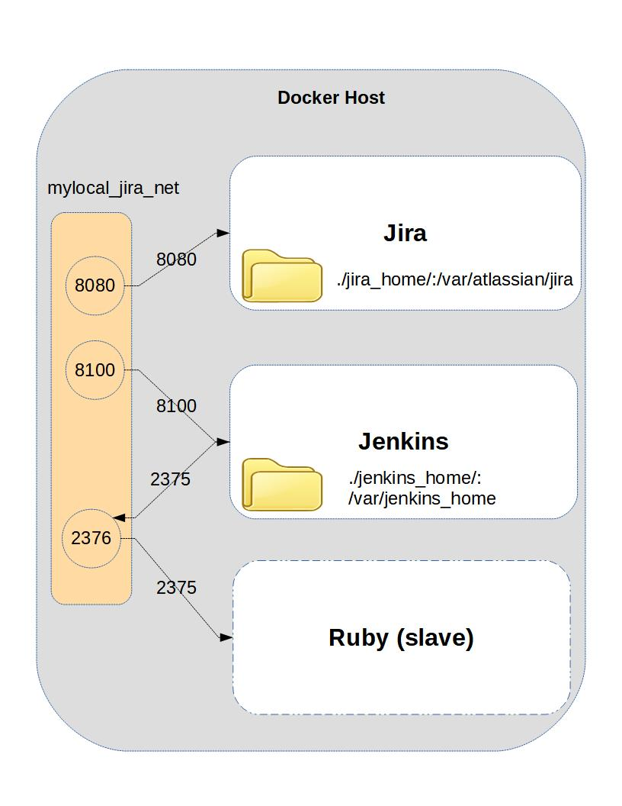

## Here is an overview of the environment:



## These are some brief instructions on how I pulled it off during the presentation:
-----

1. Install the docker daemon from [docker.com](https://www.docker.com/get-started).
1. Open a Powershell in the directory of this repo and execute the command: 

    ```
    ./start_jira_xray.ps1
    ```

1. Navigate to your new Jira instance and configure it: `http://localhost:8080` 
	- Use the built-in database
	- Configure trial license and enter admin account details (no mail server)
1. Install the Xray add-on to the Jira server instance from the Atlassian Marketplace
1. Import the Gas Data Test test project in the Jira instance from `xray-example-database.zip` for some examples of test issues.  The Gas Data web page is a single web page that logs trips to the gas pump.  I included the page in this zip file so that you can see it work a little bit.
1. Expose a proxy on the docker host so that the Jenkins host can spin up docker slaves (on a Windows daemon)
1. Navigate to your new Jenkins Server: `http://localhost:8100`
1. Install the Jenkins Xray plugin on the Jenkins server (NOTE: I had to upgrade my Jenkins instance to 2.73.1 to accomplish this) 
	- Upload the `xray-for-jira-connector.hpi` and follow the instructions
1. Under Manage Jenkins -> Configure System -> Xray for JIRA configuration section, Set the Server Address as http://host.docker.internal:8080, and set other variables accordingly	
1. install "Docker Slaves Plugin" in Jenkins
1. Under Manage Jenkins -> Configure System -> Cloud, 
	- configure docker server settings
	- Add Docker Template
1. Set up a build definition to export the tests from Jenkins.  Once configured, execute this build.  You should see feature files in the build workspace for this build. Here is my config:
1. Set up a build definition to dynamically spin up the Ruby slave and execute the tests.  At first the build will fail since you have no step definitions defined for the feature files defined.  To make the tests pass I created empty ruby functions for each step of the feature files.  Once working the build should execute cleanly.  NOTE: make sure you execute this build in the same workspace as defined in your first build definition.  Here is my config.
1. Create a third build definition to suck the test results back into Jira.  Here is my config. 
1. Navigate back to your Jira instance to see your test execution results.  If everything went correctly you should see a new test execution with a large number in the summary.  The number is a Unix timestamp corresponding to when you executed the Ruby build.  
1. Stop all containers with the command: `.\stop_all.ps1`

There are many ways to improve this setup.  The idea was to get you started with the definition that I used in the Columbus AUG talk.  I welcome your ideas of how you set up your environment.

Good luck in your continuous integration efforts.

I also offer a workshop on getting CI/CD environments like this one going in your own efforts.  Please let me know if you are interested in participating in this workshop.

a docker issue with a lot of info on containers connecting to hosts
https://github.com/docker/for-win/issues/453

Other Resources:

	- Ruby slave: https://devopscube.com/docker-containers-as-build-slaves-jenkins/

	- docker jenkins ruby: https://github.com/Signiant/docker-jenkins-ruby

